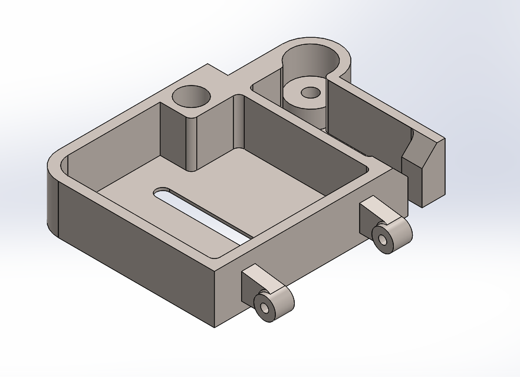

# Final Exam — End Semester SolidWorks Task

This part was modeled independently during the end-semester 
final practical exam for BS Mechatronics Engineering (Semester 1).

**Part:** Multi-feature mechanical housing with bores, slots, 
pin joints, and mounting features.

**Techniques Used:** Extrude Boss/Base, Extrude Cut, Fillet, Shell

**Institution:** Air University, Islamabad
**Semester:** 1st Semester (2025)
