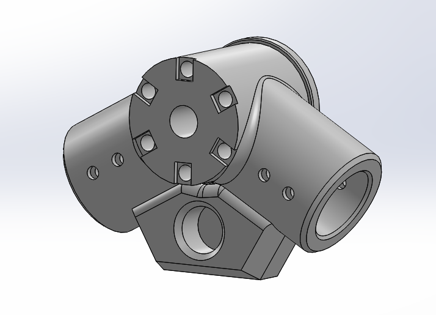
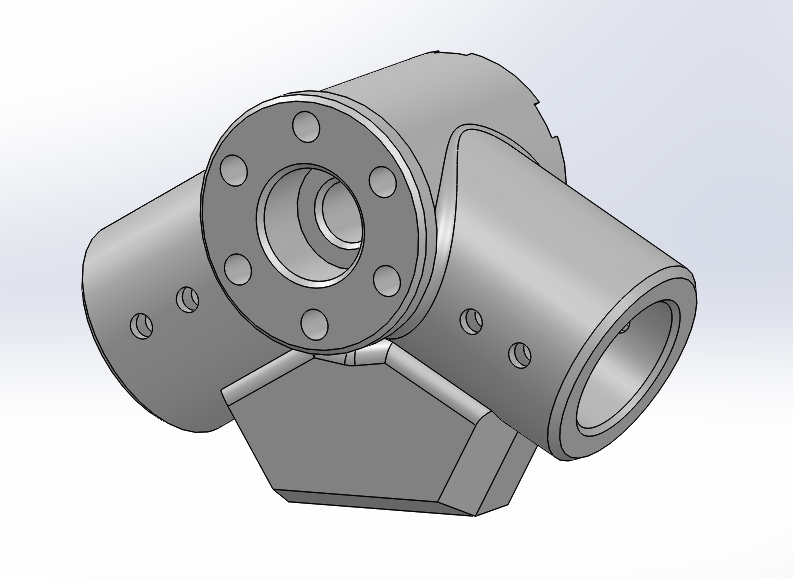
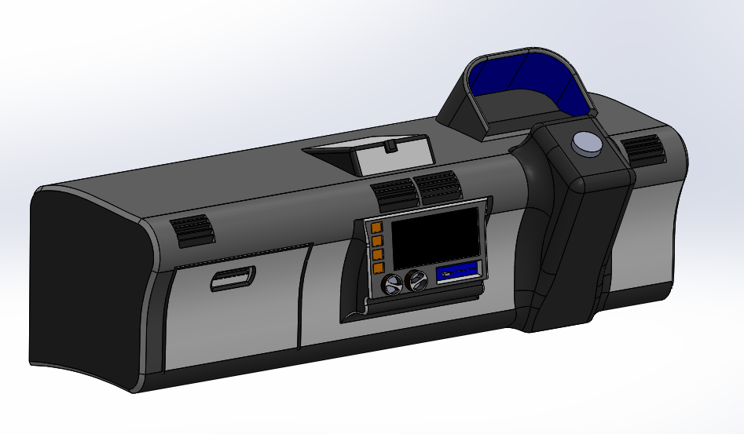

# University Projects

SolidWorks projects completed as part of BS Mechatronics Engineering coursework 
at Air University, Islamabad.

> **Note:** Although these were assigned as group projects, all 3D SolidWorks modeling 
> and report documentation were completed by me. 2D hand sketches were a collaborative effort.

---

## Project 1: Y-Joint Pipe Fitting

A 3D model of a Y-joint mechanical component used in piping and duct systems.
Designed with a **mass constraint of under 100 grams** using ABS material.
Final model achieved a mass of **95.49g**.

**Techniques Used:** Extrude Boss/Base, Shell, Fillet, Chamfer, Extrude Cut

 

---

## Project 2: Car Dashboard

A 3D car dashboard modeled **entirely from visual imagination** using only 
a reference image — no manufacturer dimensions or specifications were used.
Demonstrates ability to reverse-engineer and estimate proportions purely 
through visualization.

**Techniques Used:** Extrude Boss/Base, Shell, Extrude Cut, Fillet, Chamfer

---

## Documentation

Full project report including 2D sketches and SolidWorks engineering drawings 
is available: [SolidWorks Project Report](SolidWorks_Project_Report.pdf)

---

**Institution:** Air University, Islamabad  
**Program:** BS Mechatronics Engineering  
**Semester:** 1st Semester (2025)  
**Tool:** SolidWorks 2025
